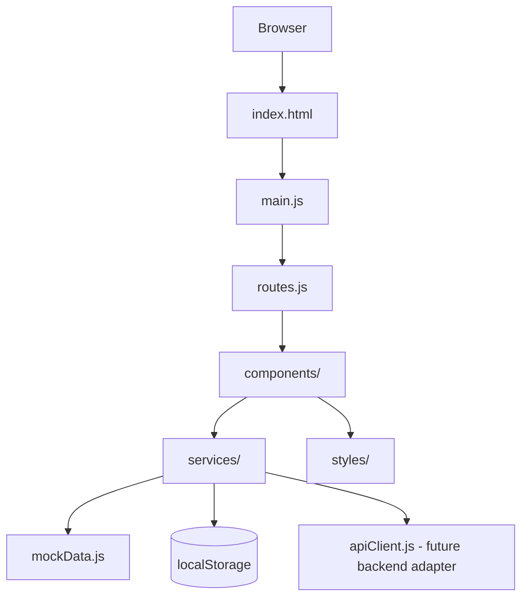

# İK Pro UI

<p align="center">
  
</p>

<p align="center">
  
  
  
  
</p>

---

## İçindekiler

- [Proje Durumu](#proje-durumu)
- [Nedir?](#nedir)
- [Ne Amaçla Yazıldı?](#ne-amaçla-yazıldı)
- [Kapsam](#kapsam)
- [Kapsam Dışı](#kapsam-dışı)
- [Ürün Vizyonu](#ürün-vizyonu)
- [Öne Çıkan Özellikler](#öne-çıkan-özellikler)
- [Teknoloji Yığını](#teknoloji-yığını)
- [Mimari Yaklaşım](#mimari-yaklaşım)
- [Proje Yapısı](#proje-yapısı)
- [Kurulum ve Çalıştırma](#kurulum-ve-çalıştırma)
- [Demo Kullanım Kılavuzu](#demo-kullanım-kılavuzu)
- [Modüller](#modüller)
- [Routing Yapısı](#routing-yapısı)
- [State ve Veri Yönetimi](#state-ve-veri-yönetimi)
- [UI/UX Tasarım Prensipleri](#uiux-tasarım-prensipleri)
- [Backend Entegrasyon Planı](#backend-entegrasyon-planı)
- [Test Kontrol Listesi](#test-kontrol-listesi)
- [Bilinen Sınırlar](#bilinen-sınırlar)
- [Geliştirme Yol Haritası](#geliştirme-yol-haritası)
- [Kısa Teknik Özet](#kısa-teknik-özet)

---

## Proje Durumu

> **Bu proje tamamlanmış bir HR SaaS ürünü değildir.**  
> Bu repo, İK Pro ürün fikrinin arayüz deneyimini, modül kurgusunu, ekran akışlarını ve SaaS dashboard yaklaşımını göstermek için hazırlanmış bir **frontend ürün arayüz demosudur**.

Mevcut sürüm:

```text
Durum        : Work in Progress
Kapsam       : Frontend UI Demo / Product Interface Prototype
Backend      : Yok
Database     : Yok
Gerçek Auth  : Yok
Veri Kaynağı : Mock data + localStorage
Amaç         : Ürün vizyonunu ve arayüz deneyimini göstermek
```

Bu ayrım bilinçlidir. Projenin bu fazdaki hedefi backend geliştirmek değil, **ürünün nasıl hissedileceğini, hangi ekranlardan oluşacağını ve kullanıcıya nasıl değer sunacağını** göstermektir.

---

## Nedir?

**İK Pro UI**, kurumsal insan kaynakları operasyonları için tasarlanmış bir **HR SaaS arayüz demo/prototipidir**.

Bu arayüz; İK ekiplerinin personel, işe alım, izin, mesai, bordro, risk takibi, aksiyon yönetimi ve operasyonel dashboard ihtiyaçlarını tek bir ürün çatısı altında nasıl yönetebileceğini göstermeyi hedefler.

Proje, şu soruya cevap arar:

> Bir KOBİ veya orta ölçekli şirket, İK süreçlerini daha modern, görsel, aksiyon odaklı ve SaaS kalitesinde bir panel üzerinden nasıl takip edebilir?

---

## Ne Amaçla Yazıldı?

Bu proje üç ana amaçla hazırlanmıştır:

### 1. Ürün Fikrini Görselleştirmek

İK Pro’nun sadece fikir seviyesinde kalmaması, somut ekranlar, akışlar ve modüller üzerinden anlaşılabilmesi hedeflenmiştir.

### 2. SaaS UI/UX Yetkinliğini Göstermek

Dashboard, rol bazlı görünüm, risk merkezi, global aksiyon merkezi, bordro ekranları, personel yönetimi ve işe alım modülleri üzerinden modern kurumsal arayüz yaklaşımı gösterilir.

### 3. Backend Öncesi Ürün Deneyimini Netleştirmek

Backend geliştirmeye geçmeden önce:

- Hangi modüller olacak?
- Kullanıcı hangi ekrandan neyi yönetecek?
- Dashboard hangi kararları destekleyecek?
- Hangi ekranlar API’ye ihtiyaç duyacak?
- Hangi roller hangi alanları görecek?

gibi soruların cevapları arayüz prototipiyle netleştirilir.

---

## Kapsam

Bu repo şu anda aşağıdaki kapsamı içerir:

| Alan | Durum |
|---|---|
| Login / Signup ekranları | Demo seviyesinde var |
| Rol bazlı frontend görünüm | Simülasyon olarak var |
| Hash routing | Var |
| Dashboard ekranları | Var |
| Risk merkezi | Var |
| Genel durum ekranı | Var |
| Global aksiyon merkezi | Var |
| Denetim izi görünümü | Var |
| Personel yönetimi | Demo seviyesinde var |
| İzin yönetimi | Demo seviyesinde var |
| Mesai / puantaj | Demo seviyesinde var |
| İşe alım modülü | Demo seviyesinde var |
| Bordro ekranları | Demo / ön hesap seviyesinde var |
| Light / dark mode | Var |
| Responsive UI | Temel düzeyde var |
| Mock data | Var |
| localStorage state | Var |
| Backend adapter hazırlığı | Taslak olarak var |

---

## Kapsam Dışı

Bu proje şu anda aşağıdakileri **içermez**:

| Alan | Açıklama |
|---|---|
| Gerçek backend | API, servis, database ve authentication server yok |
| Gerçek database | Veriler mock data ve localStorage üzerinden çalışır |
| Gerçek güvenlik | Login ve rol yapısı sadece frontend simülasyonudur |
| Gerçek bordro hesap motoru | Bordro ekranları demo/ön hesap niteliğindedir |
| Gerçek dosya yükleme | Evrak, CV veya bordro dosyası upload altyapısı yok |
| Gerçek notification sistemi | Bildirimler mock/demo seviyesindedir |
| Production deployment | Henüz production dağıtım hedeflenmemiştir |
| Tam test otomasyonu | Şu an manuel test checklist yaklaşımı kullanılır |

---

## Ürün Vizyonu

İK Pro’nun uzun vadeli vizyonu:

```text
Operasyonel İK + Risk/Aksiyon Intelligence + Bordro/Uyum Kontrolü
```

Ürün, klasik personel takip ekranlarından daha fazlasını hedefler.

Amaç sadece veri göstermek değil; İK yöneticisine şu soruların cevabını hızlı vermektir:

- Hangi departmanda risk yükseliyor?
- Hangi aksiyonlar gecikti?
- Hangi çalışanlar veya ekipler dikkat istiyor?
- Hangi belgeler, izinler veya bordro kontrolleri bekliyor?
- İşe alım süreci hangi aşamada tıkanıyor?
- Yönetici yükü nerede artıyor?
- Bugün hangi operasyonel kararlar alınmalı?

---

## Öne Çıkan Özellikler

### Ürün ve UX Özellikleri

- Risk odaklı İK dashboard’u
- Genel operasyon görünümü
- Global aksiyon merkezi
- Denetim izi / aktivite geçmişi
- Rol bazlı demo görünüm
- İşe alım pipeline ekranları
- Personel yönetimi ekranları
- İzin, mesai ve puantaj ekranları
- Bordro ön hesap ve ayar ekranları
- Light / dark tema desteği
- Açılır / kapanır sidebar
- Kurumsal SaaS tasarım dili
- Dashboard kartları, tablolar, badge’ler ve grafik alanları

### Teknik Özellikler

- Backend’siz statik frontend yapı
- Hash tabanlı client-side routing
- `localStorage` tabanlı demo session yönetimi
- Mock data servis yaklaşımı
- Backend’e bağlanmaya hazırlanmış API client taslağı
- Route config üzerinden merkezi sayfa yönetimi
- Rol kontrolünün frontend simülasyonu
- Modül bazlı component dosyaları
- Modül bazlı CSS dosyaları

---

## Teknoloji Yığını

Bu sürüm framework kullanmayan sade bir frontend prototipi olarak hazırlanmıştır.

| Teknoloji | Kullanım |
|---|---|
| HTML | Sayfa iskeleti |
| CSS | Tasarım sistemi, layout, responsive yapı |
| Vanilla JavaScript | Routing, state, event yönetimi |
| Chart.js | Grafik ve dashboard görselleştirmeleri |
| Font Awesome | İkonlar |
| localStorage | Demo session, tema, sidebar ve ayar saklama |
| Hash Routing | Statik dosya olarak çalışabilen route sistemi |
| Mock Data | Backend öncesi demo veri akışı |

> Not: Bu sürüm React, TypeScript veya backend içermez. İlerleyen fazda React + TypeScript frontend ve .NET backend entegrasyonu planlanabilir.

---

## Mimari Yaklaşım

Bu repo, küçük bir statik demo gibi görünse de bilinçli şekilde katmanlandırılmıştır.



Temel prensip:

```text
Ekranlar component katmanında,
demo veri servis katmanında,
route yönetimi merkezi route config içinde,
kalıcı demo state localStorage içinde tutulur.
```

Bu ayrım, ileride backend veya modern frontend framework geçişi yapılırken ekranların tamamen dağılmasını engellemeyi hedefler.

---

## Proje Yapısı

```text
.
├── index.html
├── main.js
├── routes.js
├── README.md
│
├── components/
│   ├── actions.js
│   ├── attendance.js
│   ├── auth.js
│   ├── dashboard.js
│   ├── layout.js
│   ├── leaves.js
│   ├── manager.js
│   ├── payroll.js
│   ├── personnel.js
│   ├── recruitment.js
│   └── settings.js
│
├── services/
│   ├── apiClient.js
│   ├── authService.js
│   └── mockData.js
│
└── styles/
    ├── actions.css
    ├── attendance.css
    ├── auth.css
    ├── layout.css
    ├── leaves.css
    ├── main.css
    ├── manager.css
    ├── payroll.css
    ├── personnel.css
    ├── recruitment.css
    └── settings.css
```

---

## Kurulum ve Çalıştırma

Bu proje build adımı gerektirmez. Statik frontend olarak çalışır.

### 1. Repoyu Klonla

```bash
git clone https://github.com/MuhammetSaitAkgunes/-K-Pro.git
cd -K-Pro
```

### 2. Statik Sunucu ile Çalıştır

Önerilen yöntem:

```bash
npx serve .
```

Alternatif Python sunucusu:

```bash
python -m http.server 3000
```

Ardından tarayıcıda aç:

```text
http://localhost:3000
```

### 3. Doğrudan HTML Olarak Açma

Proje hash routing kullandığı için temel demo akışı doğrudan `index.html` dosyası tarayıcıda açılarak da incelenebilir.

Ancak daha stabil davranış için lokal statik sunucu önerilir.

---

## Demo Kullanım Kılavuzu

### Login

Proje gerçek authentication yapmaz. Login ekranı demo session oluşturur.

Genel akış:

```text
#/login
Giriş yap
→ demo session localStorage'a yazılır
→ dashboard açılır
```

### Demo Roller

Arayüzde rol bazlı görünüm simülasyonu bulunur.

| Rol | Açıklama |
|---|---|
| `hr-admin` | Tüm ana İK modüllerini görebilen yönetici görünümü |
| `manager` | Ekip, izin, mesai, aksiyon ve risk odaklı yönetici görünümü |
| `employee` | Self-servis ağırlıklı sınırlı çalışan görünümü |

> Kritik not: Bu rol kontrolü sadece frontend UX simülasyonudur. Gerçek güvenlik için backend authorization policy gerekir.

### Tema Değiştirme

Light/dark tema tercihi `localStorage` içinde saklanır.

### Sidebar

Sidebar açık/kapalı tercihi `localStorage` içinde saklanır.

---

## Modüller

### Risk Merkezi

Ana karar ekranıdır.

Hedef soru:

```text
Hangi İK riski büyüyor, neden büyüyor ve hangi aksiyon alınmalı?
```

İçerikler:

- İK risk skoru
- Ayrılma riski
- Tükenmişlik sinyalleri
- Yönetici yükü
- Departman bazlı risk görünümü
- Aksiyon merkezi bağlantıları
- Kurumsal sinyaller

---

### Genel Durum

Operasyonel İK dashboard ekranıdır.

İçerikler:

- Aktif personel
- Onay bekleyen işlemler
- Açık pozisyonlar
- Kritik hatırlatmalar
- Departman dağılımı
- İşe alım hunisi
- Günlük operasyon görünümü

---

### Global Aksiyon Merkezi

Farklı modüllerden gelen işleri tek ekranda toplamayı hedefler.

İçerikler:

- Bugün kapanacak aksiyonlar
- Geciken aksiyonlar
- Yüksek öncelikli işler
- Tamamlanan aksiyonlar
- Denetim izi sekmesi
- Kaynak modüle hızlı geçiş

---

### Denetim İzi

Ürün içinde gerçekleşen önemli aksiyonları timeline mantığıyla göstermeyi hedefler.

Örnek kayıtlar:

- Kullanıcı giriş yaptı
- Bordro ayarı güncellendi
- Risk aksiyonu oluşturuldu
- Uyum evrak durumu değişti
- İzin talebi onaya gönderildi

---

### Personel Yönetimi

Çalışan kayıtlarının yönetileceği temel modül prototipidir.

İçerikler:

- Personel listesi
- Personel kartları
- Yeni personel ekleme modalı
- Departman / rol / durum bilgileri

---

### İzinler

İzin yönetim sürecinin demo ekranıdır.

İçerikler:

- İzin bakiyesi
- Bekleyen izin talepleri
- Ekip yokluk görünümü
- İzin talebi oluşturma akışı

---

### Mesai ve Puantaj

Çalışma zamanı ve puantaj takibi için tasarlanmış demo modüldür.

İçerikler:

- Canlı çalışma durumu
- Mesai kayıtları
- Puantaj görünümü
- Tab bazlı ekran akışı

---

### İşe Alım

Aday takip ve işe alım operasyonları için demo modüldür.

İçerikler:

- Aday pipeline
- CV ve aday bilgileri
- Mülakat notları
- Değerlendirme sekmeleri
- İşe alım geçmişi

---

### Yönetici Konsolu

Yönetici rolüne özel ekip ve operasyon görünümüdür.

İçerikler:

- Ekip özeti
- Onay bekleyen işlemler
- Operasyonel riskler
- Yöneticiye özel aksiyonlar

---

### Bordro

Bordro modülü demo / ön hesap seviyesindedir.

Route’lar:

```text
#/payroll
#/payroll/calculator
#/payroll/settings
```

İçerikler:

- Dönem bordrosu görünümü
- Çalışan bordro tablosu
- Bordro detay paneli
- Tekil bordro hesaplama ekranı
- Bordro varsayılan ayarları
- localStorage tabanlı demo ayar saklama

> Bordro hesapları resmi veya üretim kullanımı için değildir. Üretim seviyesinde mevzuat, mali müşavir kontrolü ve backend hesap motoru gerekir.

---

## Routing Yapısı

Proje hash tabanlı client-side routing kullanır.

Örnek route’lar:

```text
#/login
#/signup
#/dashboard
#/overview
#/actions
#/personnel
#/recruitment
#/attendance
#/leaves
#/payroll
#/payroll/calculator
#/payroll/settings
#/manager
#/settings
#/risk/attrition
#/risk/burnout
#/risk/manager-load
#/risk/action-center
#/risk/employee-voice
#/risk/compliance
```

Routing tercihinin sebebi:

```text
Projeyi backend fallback yapılandırması olmadan,
statik dosya olarak kolayca çalıştırabilmek.
```

---

## State ve Veri Yönetimi

Bu demo sürümde veriler iki kaynaktan gelir:

1. Mock data
2. localStorage

### localStorage Anahtarları

| Anahtar | Amaç |
|---|---|
| `ikpro-demo-session` | Demo kullanıcı session bilgisi |
| `ikpro-theme` | Light/dark tema tercihi |
| `ikpro-sidebar` | Sidebar açık/kapalı tercihi |
| `ikpro-payroll-settings` | Bordro varsayılan ayarları |

### Mock Data

Mock data, backend geliştirilmeden önce ekranların gerçekçi veriyle incelenmesini sağlar.

Bu yaklaşım sayesinde:

- UI akışları hızlı test edilir
- Dashboard kompozisyonu doğrulanır
- Backend API ihtiyaçları daha net çıkarılır
- Ürün hissi erken aşamada görünür olur

---

## UI/UX Tasarım Prensipleri

Bu arayüzde hedeflenen tasarım yaklaşımı:

```text
Kurumsal ama ağır değil.
Veri yoğun ama boğucu değil.
Görsel ama oyuncak gibi değil.
Aksiyon odaklı, okunabilir ve SaaS kalitesinde.
```

Ana prensipler:

- Dashboard’larda karar destek önceliği
- Kartlarda sade ama yoğun bilgi hiyerarşisi
- Risk ve aksiyonların görsel olarak öne çıkarılması
- Rol bazlı arayüz deneyimi
- Tablo, badge, buton ve form bileşenlerinde tutarlı tasarım dili
- Light/dark mode desteği
- Mobil ve tablet kırılımlarında taşmayı azaltan responsive yapı
- Yazıdan çok hızlı anlamaya yardımcı görsel düzen

---

## Backend Entegrasyon Planı

Bu proje şu anda backend içermez. Ancak ileride .NET tabanlı backend ile entegre edilecek şekilde genişletilebilir.

Önerilen backend mimarisi:

```text
.NET 8/9 Web API
Clean Architecture
SQL Server
JWT Authentication
Role-based Authorization
Audit Logging
File Storage
Background Jobs
Notification System
```

### Beklenen Backend Modülleri

| Modül | Açıklama |
|---|---|
| Auth | Login, register, token, refresh token |
| Users & Roles | Kullanıcı, rol ve yetki yönetimi |
| Personnel | Çalışan master data |
| Recruitment | Aday ve iş ilanı yönetimi |
| Leaves | İzin talep/onay akışı |
| Attendance | Mesai ve puantaj kayıtları |
| Payroll | Bordro hesap motoru |
| Actions | Global aksiyon yönetimi |
| Audit Logs | Denetim izi kayıtları |
| Documents | Evrak ve dosya yönetimi |
| Notifications | Hatırlatma ve bildirimler |

---

## Kısa Teknik Özet

```text
İK Pro UI; kurumsal İK operasyonları için hazırlanmış,
backend içermeyen, mock data ve localStorage ile çalışan,
hash routing tabanlı, vanilla HTML/CSS/JavaScript kullanılarak geliştirilmiş
bir HR SaaS ürün arayüz demosudur.
```

---

## Kısa Ürün Özeti

```text
İK Pro; personel, işe alım, izin, mesai, bordro, risk ve aksiyon yönetimini
tek bir modern SaaS arayüzünde birleştirmeyi hedefleyen bir HR Tech ürün fikridir.
Bu repo, ürünün ilk arayüz/prototip katmanını temsil eder.
```

---

<p align="center">
  
</p>
